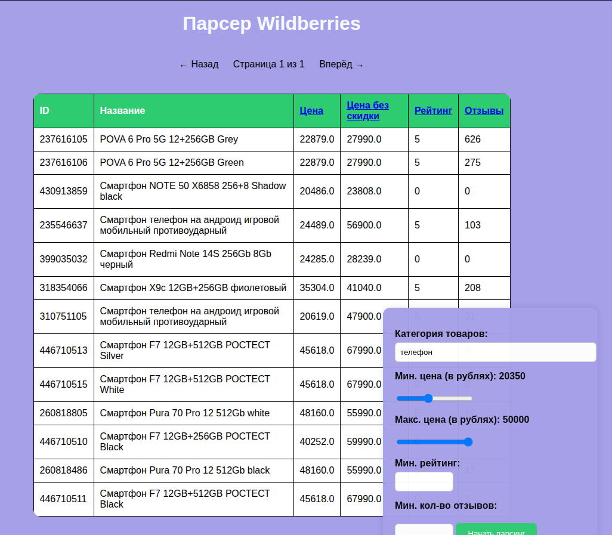

# Wildberries Parser App (demo)

This Django-based web application allows you to parse and display product data from Wildberries by category, with flexible filtering and sorting options.

Due to a limited number of proxies and the risk of being blocked, this version only parses the first page of requested category.

⚠️ Warning: CSRF protection is disabled for demo purposes. Do not use this in production without enabling CSRF.




## Features

- **Category Parsing:** Enter a product category to fetch and store data from Wildberries.
- **Filtering:** Filter products by minimum/maximum price, minimum rating, and minimum number of reviews.
- **Sorting:** Sort results by price, original price, rating, or number of reviews (ascending/descending).
- **Web Interface:** User-friendly form for input and a table for displaying results.
- **Persistent Filters:** All filter and sort parameters are preserved in the URL for easy sharing and navigation.
- **Logging:** Key actions and errors are logged for debugging and monitoring.
- **Grafs:**  Prices/products amount, discounts/products rates


## Installation

1. **Clone the repository:**
   ```bash
   git clone https://github.com/ReptiloidAnunak/wildberries_pars_app
   cd wildberries_pars_app
   ```

2. **Environment**

   Put your .env file to the project`s root folder

3. **Install dependencies:**
   ```bash
   docker-compose up -d --build
   ```


4. **Open in your browser:**
   ```
   http://127.0.0.1:8000/api/products/
   ```

## How It Works

1. **Enter a category and filter parameters** in the form and submit.
2. The app parses products from Wildberries using the specified category.
3. Products are saved to the database and displayed in a sortable, filterable table.
4. You can adjust filters and sorting directly from the web interface.


## Usage

- Fill in the category and any desired filters.
- Click "Start Parsing" to fetch and display products.
- Click on table headers to sort by that column (click again to reverse order).
- All filters and sorting are preserved in the URL for easy bookmarking.

## Grafana logs
To see logs in Grafana you should run

```bash
./dev_tools/shell_scripts/run_grafana.sh
```

Login Grafana: http://127.0.0.1:3000/login

Grafana login:
```
Login: admin
Password: admin
```
How to setup: https://grafana.com/docs/grafana/latest/setup-grafana/


## Project Structure

- `product/views.py` — Main logic for handling requests, parsing, filtering, and sorting.
- `templates/products_page.html` — Main web interface.
- `product/models.py` — Product model definition.
- `parsers/wb_parser.py` — Wildberries parsing logic.
- `logger.py` — Logging configuration.

## Notes

- The app uses Django REST Framework for API views.
- CSRF protection is disabled for demonstration purposes; enable it for production.
- Logging is configured via `logger.py` and settings.

---

**Developed by ReptiloidAnunak**